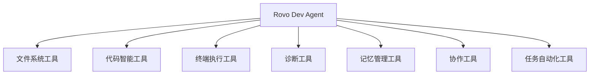

# 🤖 Rovo Dev Agent 设计文档

本目录包含基于 Rovo Dev 能力设计的综合型 AI Coding Agent 完整方案。

## 📁 文件结构

```
rovo-dev/
├── README.md                           # 本文件 - 目录概述
├── README-ROVO-DEV-AGENT.md           # 项目主文档 - 设计概述和实现指南
├── rovo-dev-agent-design.json         # 工具体系设计 - JSON Schema 定义
├── rovo-dev-agent-prompts.md          # 提示词设计 - 系统提示词和模板
└── rovo-dev-agent-implementation.ts   # 实现示例 - TypeScript 代码示例
```

## 🎯 设计目标

基于对项目中多家 AI Coding Agent 工具的深入分析，结合 Rovo Dev 的现有能力，设计一个：

- **功能全面**: 涵盖文件操作、代码智能、终端执行、诊断、记忆管理等
- **安全可靠**: 多层安全机制，防止命令注入和误操作
- **智能协作**: 语义理解、自主执行、个性化适配
- **深度集成**: 与 Atlassian 产品和开发工具链无缝集成

## 🚀 核心特色

### 1. 多源融合优势
- **Rovo Dev**: 文件操作 + Atlassian 集成
- **Claude Code**: 安全机制 + 简洁设计
- **Augment**: 进程管理 + 任务自动化
- **Lingma**: 记忆管理 + 诊断能力
- **Cascade**: 语义搜索 + 智能代理

### 2. 工具体系架构


### 3. 智能工作流
- **代码分析**: 语义搜索 → 文件打开 → 代码展开 → 符号定位
- **问题修复**: 诊断检查 → 原因分析 → 修复实施 → 质量验证
- **任务自动化**: 任务分解 → 自主执行 → 进度跟踪 → 结果总结

## 📖 文档说明

### 📋 [README-ROVO-DEV-AGENT.md](./README-ROVO-DEV-AGENT.md)
**项目主文档** - 完整的设计概述
- 设计理念和核心优势
- 工具能力对比分析
- 工作流程和使用示例
- 实现建议和部署架构
- 预期收益和下一步行动

### 🔧 [rovo-dev-agent-design.json](./rovo-dev-agent-design.json)
**工具体系设计** - 结构化的工具定义
- 完整的工具分类和定义
- JSON Schema 参数规范
- 安全框架和性能优化
- 扩展性和集成能力配置

### 🎨 [rovo-dev-agent-prompts.md](./rovo-dev-agent-prompts.md)
**提示词设计** - 智能交互的核心
- 系统提示词和核心能力描述
- 场景专用提示词模板
- 工作流程和错误恢复提示词
- 个性化适配和技能提升引导

### 💻 [rovo-dev-agent-implementation.ts](./rovo-dev-agent-implementation.ts)
**实现示例** - 可执行的代码框架
- TypeScript 类型定义
- 工具规范和安全配置
- 代理类和工具管理器
- 工作流程模式和使用示例

## 🛠️ 快速开始

### 1. 查看设计概述
```bash
# 阅读主文档了解整体设计
cat README-ROVO-DEV-AGENT.md
```

### 2. 理解工具体系
```bash
# 查看工具定义和配置
cat rovo-dev-agent-design.json | jq '.tool_categories'
```

### 3. 学习提示词设计
```bash
# 查看系统提示词
grep -A 20 "核心系统提示词" rovo-dev-agent-prompts.md
```

### 4. 参考实现代码
```bash
# 查看 TypeScript 实现
head -50 rovo-dev-agent-implementation.ts
```

## 🎯 实现路径

### 阶段一：核心功能 (MVP)
- [ ] 文件操作工具 (`open_files`, `expand_code_chunks`, `find_and_replace_code`)
- [ ] 基础搜索工具 (`grep_file_content`, `codebase_search`)
- [ ] 安全的终端执行 (`bash` with security)

### 阶段二：智能增强
- [ ] 代码诊断工具 (`get_diagnostics`, `code_quality_check`)
- [ ] 符号搜索工具 (`symbol_search`)
- [ ] 项目记忆管理 (`project_memory`)

### 阶段三：自动化
- [ ] 任务自动化 (`autonomous_agent`, `task_planner`)
- [ ] 进程管理 (`process_management`)
- [ ] 长期记忆 (`long_term_memory`)

### 阶段四：集成协作
- [ ] Git 操作 (`git_operations`)
- [ ] Atlassian 集成 (`atlassian_integration`)
- [ ] 可视化工具 (`mermaid_diagram`)

## 🤝 贡献指南

1. **功能扩展**: 基于 `ToolSpec` 接口添加新工具
2. **安全增强**: 完善 `SecuritySpec` 配置
3. **工作流优化**: 扩展 `WorkflowPatterns` 模式
4. **提示词改进**: 优化场景专用提示词模板

## 📞 联系方式

如有问题或建议，请通过以下方式联系：
- 创建 Issue 讨论功能需求
- 提交 PR 贡献代码改进
- 分享使用经验和最佳实践

---

**让我们一起构建更智能的编程助手！** 🚀